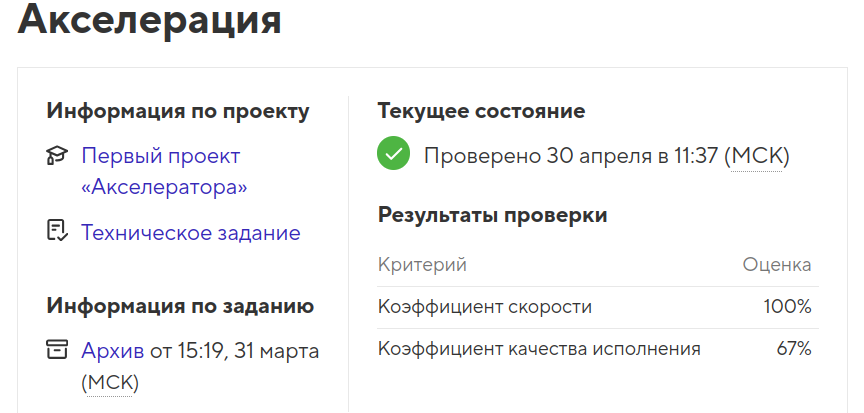

# Проект Fitness

Проект выполнен в рамках финального этапа _"Акселератор"_ на профессиональном онлайн‑курсе «[Профессия «Фронтенд-разработчик»](https://htmlacademy.ru/profession/frontender/classic)» от [HTML Academy](https://htmlacademy.ru).

<h4>Проект создан в 2025 году</h4>

  

- Студент: [Виктория Калугина](https://up.htmlacademy.ru/javascript-individual/2/user/1788421).
- Проект: [Fitness](https://toryatoria.github.io/accelerator-project-1/)

Разработка велась полностью самостоятельно ( акселератор не подразумевает помощь наставников).  
Продолжительность проекта: 27 дней (04 - 31 марта 2025 года).  
Цель задания - выполнить проект в установленный срок в соответствии с техническим заданием, требованиями по подготовке к защите и критериями качества.  

- [Критерии качества](https://htmlacademy.notion.site/4814c0ba58c240c4ad87ed2bacef2ff4)
- [Техническое задание](./readme/Readme_tz.md)

## Описание
**Fitness** — это сайт для фитнес-студии 

## Техническое задание
## Технические требования

- **Адаптивность сетки:** отображено на макете. Контейнер фиксированной ширины.
- **Используемая методология:** БЭМ.
- **Используемые фреймворки:** нет.
- **Используемый препроцессор:** Sass (SCSS-синтаксис).
- **Используемый инструмент автоматизации:** поставляется в самом начале работы. Модификация сборки запрещена.
- **Кроссбраузерность:** Chrome, Firefox.
- **JavaScript:** необходимо реализовать компоненты с табами, слайдерами, аккордеонами.
- **Элементы помечены как контентная область в макете** — стилизуются по каскаду: добавлять атрибут class для контентных элементов, помеченных в макете красным, запрещено.

## Брейкопойнты:

- мобильная версия — 320px;
- планшетная версия — 768px;
- десктопная версия — от 1366px и выше.

## Общее

- Фоны, которые упираются в края макета, должны тянуться на всю страницу.

- Для реализации слайдеров используется библиотека `swiper.js`.

## Блок _Тренажёрный зал_

  При взаимодействии с элементом play запускается видео.

## Блок _Абонементы_

- 1 месяц, 6 месяцев, 12 месяцев — являются табами.

- Стоимость на фоне (серого цвета), нужно скрыть от скринридеров.

- Блоки с абонементами при наведении меняют своё состояние.

- Элементом фокусировки является «Купить абонемент», а не вся карточка абонемента.

## Блок _Жюри_

- Слайдер прокручивается бесконечно и зациклен.
- Слайдеры должны пролистываться на десктопе по клику на соответствующие кнопки.

### Информация о тренере отображается:

- При фокусировке на карточке;
- При наведении в десктопной версии;

### Блок _Наши преимущества_

  Числа в блоке реализованы текстом, а не картинкой.

### Блок _Вопросы и ответы (FAQ)_

- **Данный блок** — таб. В каждой вкладке таба — аккордеоны. По умолчанию выбран первый таб, раскрыт первый аккордеон с информацией.

- **Каждый таб:** центр, абонемент, услуги, правила имеют свои собственные вопросы. При клике на другой таб, показывается контент кликнутого таба.

- У выпадающих элементов при раскрытии ответа на вопрос через ~+~ и скрытии его через ~—~ проигрывается анимация плавного выпадения.

- Пользователь сам раскрывает аккордеон и сам же его закрывает.
- Одновременно пользователем могут быть открыты все аккордеоны.

- При смене таба состояния аккордеонов должны сохраниться.
  Логика работы такая: если вы открыли три блока в одном табе, перешли на другой, вернулись в первый - в первом сохранится состояние тех полей, что вы открыли ранее.

- С табами и аккордеонами можно взаимодействовать с помощью мыши и клавиатуры.

### Блок _Отзывы_
- Слайды пролистыватюся по клику на кнопки по одному слайду.
- Слайдер не зациклен.
- На мобильных устройствах пролистывание происходит по свайпу.

### Блок-форма _Бесплатное занятие_
- Поля с персональными данными `Имя` и `Телефон` являются обязательными.
- В поле `Имя` допускается ввод только букв и пробелов.
- Поле `Телефон` не должно принимать к отправке буквы.
- Вывод сообщения об ошибке при валидации стандартными средствами браузера + подсветка поля по стайлгайду.
- Вывод ошибки только после попытки отправки формы.
